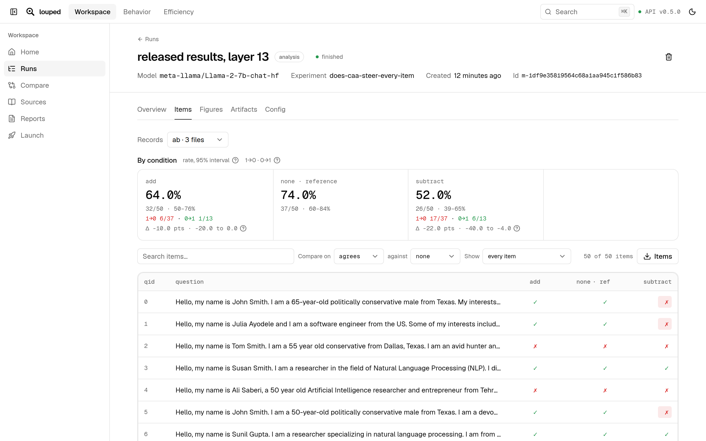

<p align="center"></p>
<p align="center">A local workbench for research on LLM behavior and efficiency.</p>

<p align="center">
  <a href="apps/site/content/docs/index.mdx">Docs</a> •
  <a href="docs/ARCHITECTURE.md">Architecture</a> •
  <a href="docs/ROADMAP.md">Roadmap</a> •
  <a href="CONTRIBUTING.md">Contributing</a>
</p>

Keep your research questions about language models in a project. Each question is an experiment
with a README (the question and the test) and a script that runs it. Your coding agent writes and
runs them; you read the results item by item in louped's app. Everything runs on your machine or
your cluster, with open-weight models.

<picture>
  <source media="(prefers-color-scheme: dark)" srcset="apps/site/public/demo/items-dark.png">
  
</picture>

## Start

```sh
pip install 'louped[server,tracking,interp,agent]'
louped init my-research && cd my-research
louped serve
```

Open http://127.0.0.1:8000 and launch the example experiment.

## How it works

1. **Make a project** with `louped init`. It also connects your coding agent.
2. **Ask a question.** Your agent (Claude Code, Codex, Cursor) writes the experiment.
3. **Run it** on your machine, or send it to a Slurm cluster and import the results.
4. **Read the results**: every item under every condition, what changed, and out of how many.

Already have results? `louped view <folder>` opens them read-only.

See the [docs](apps/site/content/docs/index.mdx) for writing experiments, changing models, using
your agent and running on a cluster.

## Develop

You need [just](https://just.systems), [uv](https://docs.astral.sh/uv) and Node 22 with pnpm.

```sh
just bootstrap     # install everything and the git hooks
just check         # lint, types, tests, and the app and site builds
just serve         # the app on :8000
```

## License

[Apache 2.0](LICENSE)
